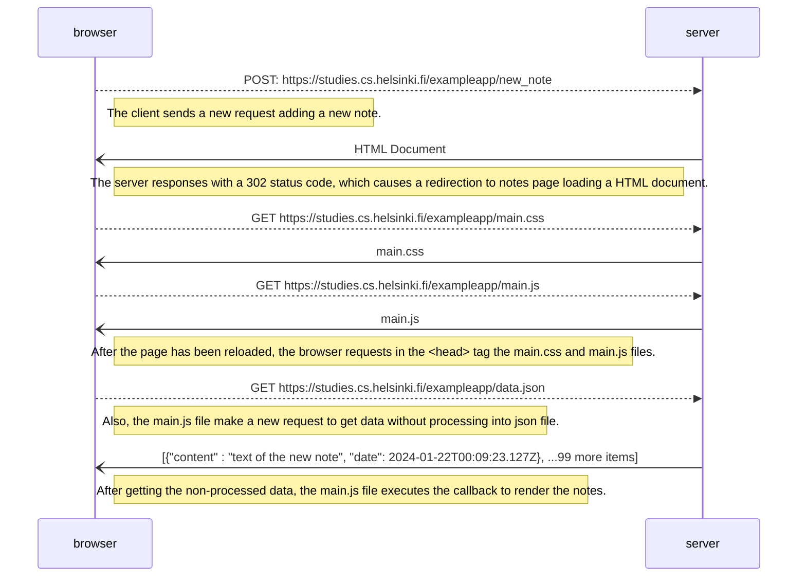

```mermaid
sequenceDiagram;

    participant browser
    participant server


    browser-->>server: POST: https://studies.cs.helsinki.fi/exampleapp/new_note
    Note right of browser: The client sends a new request adding a new note.

    server-)browser: HTML Document
    Note left of server: The server responses with a 302 status code, which causes a redirection to notes page loading a HTML document.

    browser-->>server: GET https://studies.cs.helsinki.fi/exampleapp/main.css
    server-)browser: main.css
    browser-->>server: GET https://studies.cs.helsinki.fi/exampleapp/main.js
    server-)browser: main.js
    Note right of browser: After the page has been reloaded, the browser requests in the <head> tag the main.css and main.js files.

    browser-->>server: GET https://studies.cs.helsinki.fi/exampleapp/data.json
    Note right of browser: Also, the main.js file make a new request to get data without processing into json file.

    server-)browser: [{"content" : "text of the new note", "date": 2024-01-22T00:09:23.127Z}, ...99 more items]
    Note right of browser: After getting the non-processed data, the main.js file executes the callback to render the notes.
```