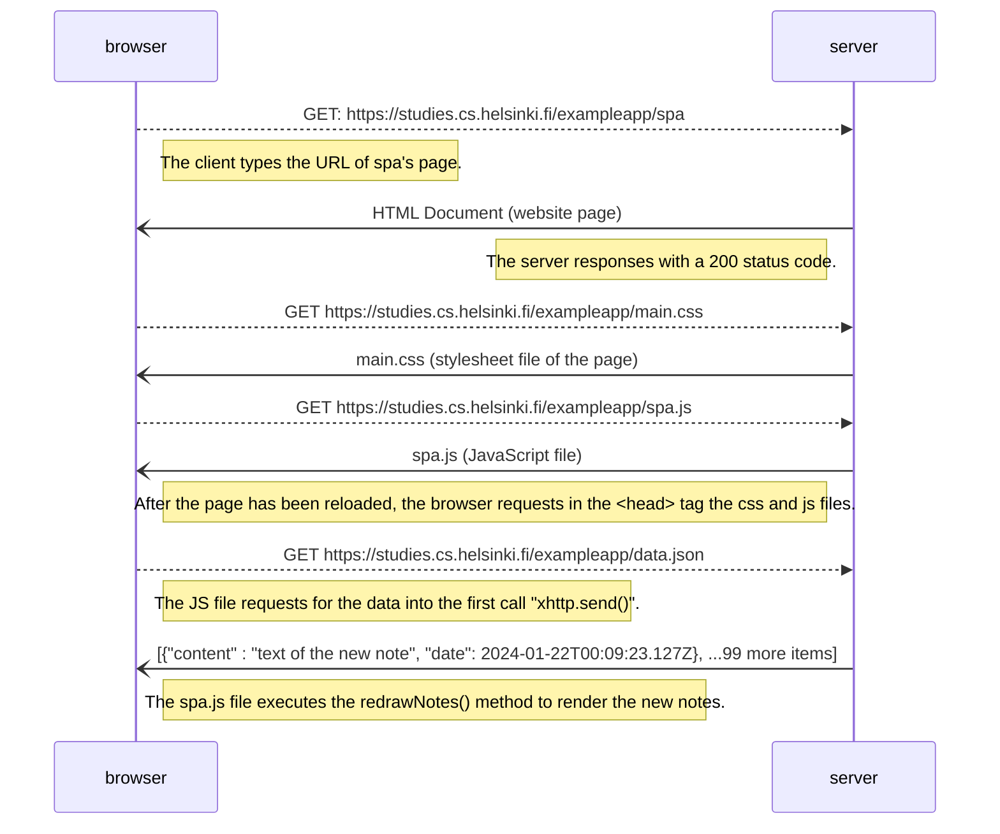

```mermaid
sequenceDiagram;

    participant browser
    participant server


    browser-->>server: GET: https://studies.cs.helsinki.fi/exampleapp/spa
    Note right of browser: The client types the URL of spa's page.

    server-)browser: HTML Document (website page)
    Note left of server: The server responses with a 200 status code. 

    browser-->>server: GET https://studies.cs.helsinki.fi/exampleapp/main.css
    server-)browser: main.css (stylesheet file of the page)
    browser-->>server: GET https://studies.cs.helsinki.fi/exampleapp/spa.js
    server-)browser: spa.js (JavaScript file)
    Note right of browser: After the page has been reloaded, the browser requests in the <head> tag the css and js files.

    browser-->>server: GET https://studies.cs.helsinki.fi/exampleapp/data.json
    Note right of browser: The JS file requests for the data into the first call "xhttp.send()".

    server-)browser: [{"content" : "text of the new note", "date": 2024-01-22T00:09:23.127Z}, ...99 more items]
    Note right of browser: The spa.js file executes the redrawNotes() method to render the new notes.
```