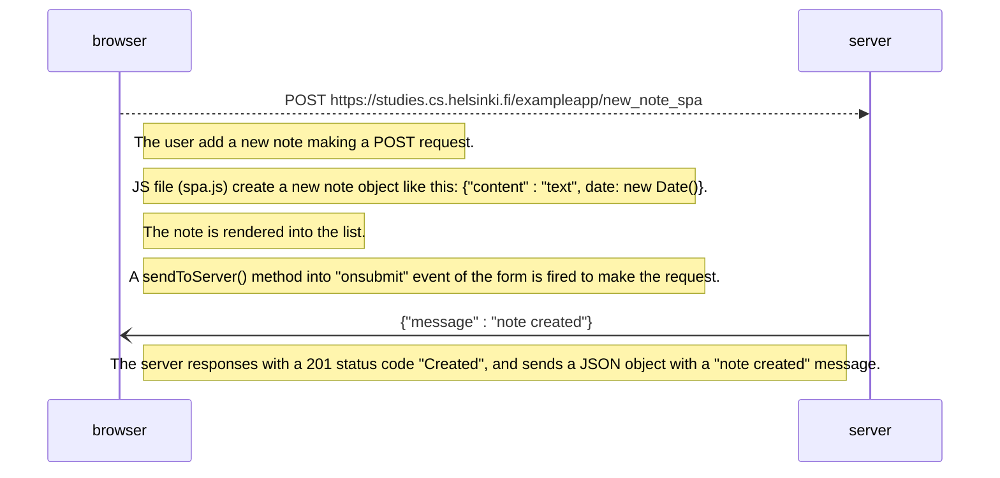

```mermaid
sequenceDiagram;

    participant browser
    participant server

    browser-->>server: POST https://studies.cs.helsinki.fi/exampleapp/new_note_spa
    Note right of browser: The user add a new note making a POST request.
    Note right of browser: JS file (spa.js) create a new note object like this: {"content" : "text", date: new Date()}.
    Note right of browser: The note is rendered into the list.
    Note right of browser: A sendToServer() method into "onsubmit" event of the form is fired to make the request.

    server-)browser: {"message" : "note created"}
    Note left of server: The server responses with a 201 status code "Created", and sends a JSON object with a "note created" message.
```